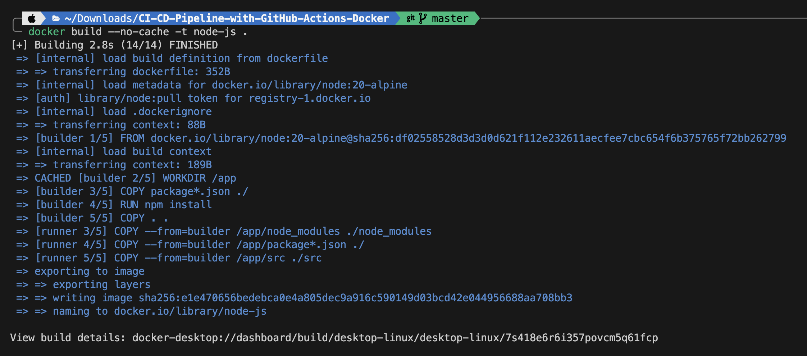
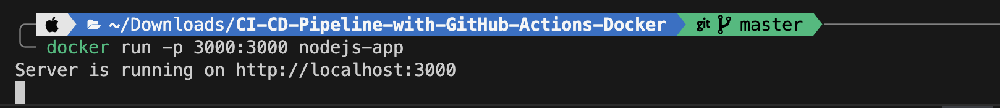
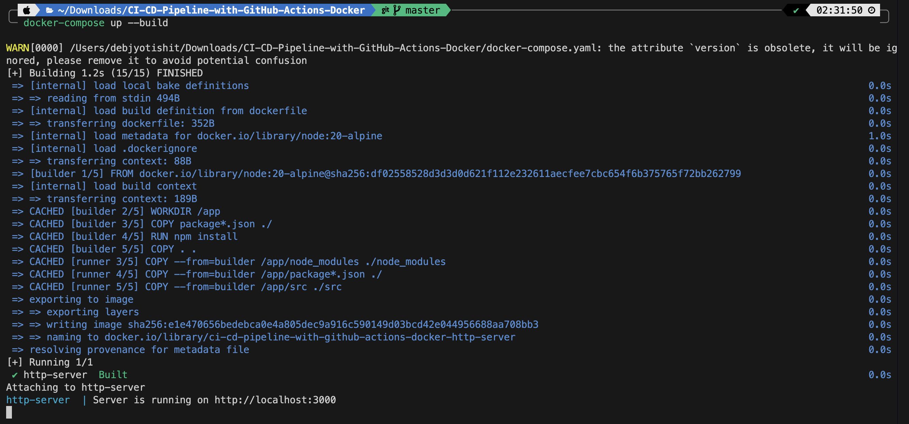
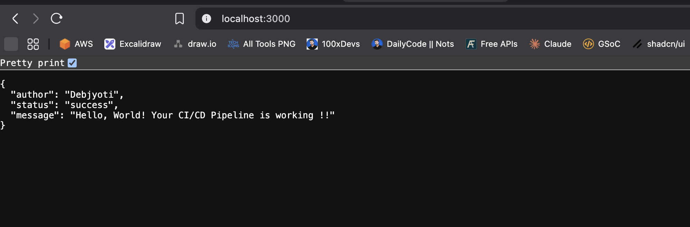
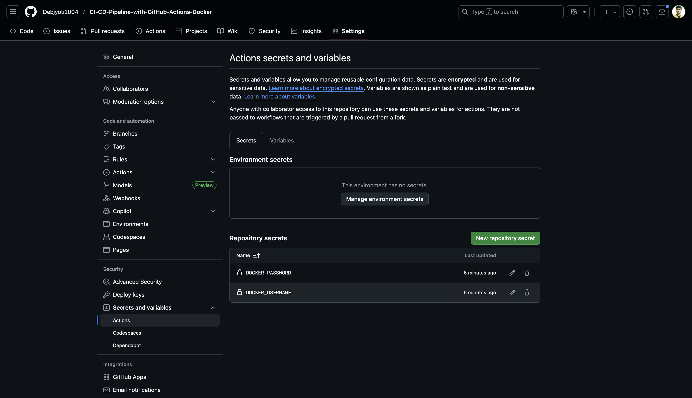
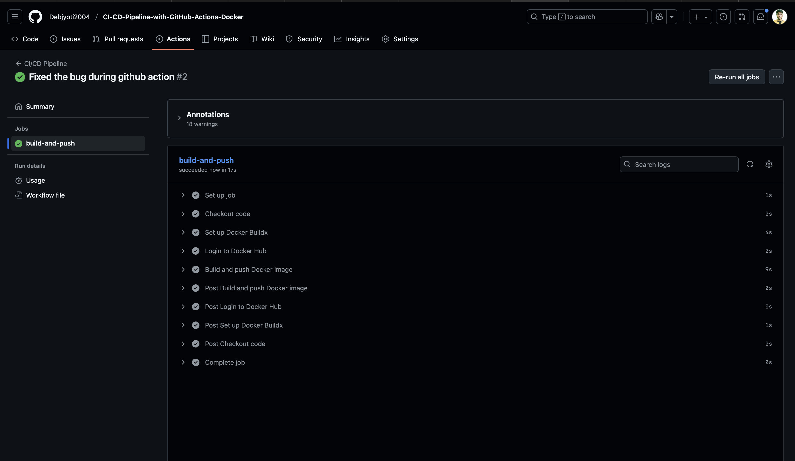
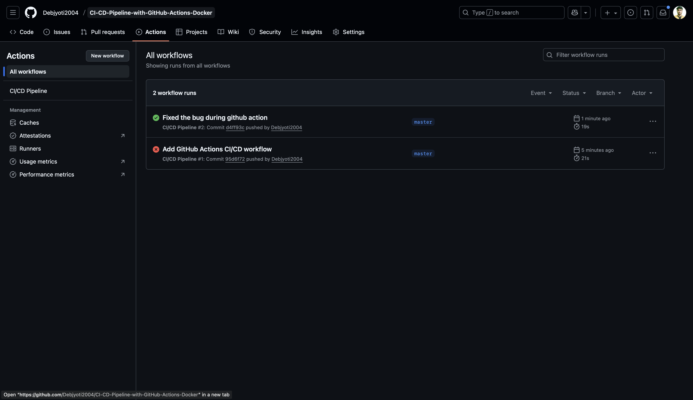
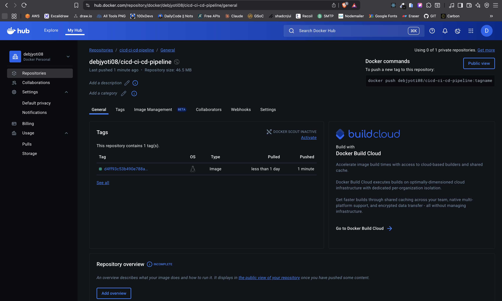
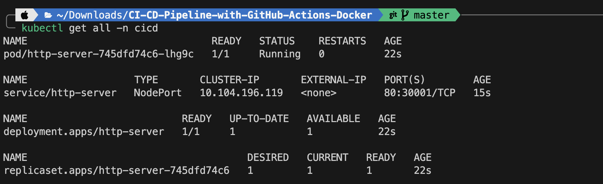
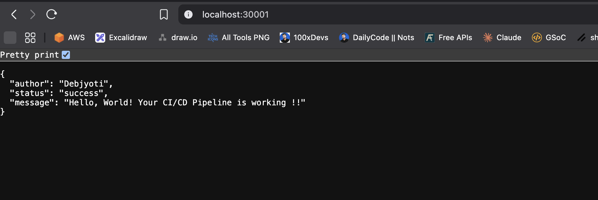

# CI/CD Pipeline with GitHub Actions, Docker, and Minikube
This project demonstrates a complete CI/CD pipeline for a simple Node.js application. The pipeline automates testing, building a Docker image, pushing it to Docker Hub, and deploying it to a local Kubernetes cluster (Minikube).

## 🚀 Project Overview
The core components of this pipeline are:

- **Application**: A simple "Hello World" web server built with Node.js and Express.

- **Containerization**: Docker is used to package the application and its dependencies into a portable image.

- **CI/CD**: GitHub Actions automates the workflow whenever code is pushed to the main branch.

- **Container Registry**: Docker Hub stores the versioned Docker images.

- **Local Deployment**: Minikube runs a local Kubernetes cluster to deploy and serve the application.

## 🛠️ Getting Started

### Prerequisites

- Node.js
- Docker
- Minikube
- A GitHub account
- A Docker Hub account

### Local Setup

1. Clone the repository:
   ```bash
   git clone https://github.com/Debjyoti2004/CI-CD-Pipeline-with-GitHub-Actions-Docker.git
   cd CI-CD-Pipeline-with-GitHub-Actions-Docker
   ```

2. Install dependencies:
```sh
npm install
```
3. Run the application locally:

```bash
node src/index.js
```

The application will be available at *http://localhost:3000*.
---
## 🐳 Dockerization

The application is containerized using the provided *Dockerfile*.
1. Build the Docker image:

```bash
docker build -t your-dockerhub-username/cicd-project .
```

 

2. Run the Docker container:

```bash
docker run -p 3000:3000 your-dockerhub-username/cicd-project
```
 

You can also use the *docker-compose.yml* file for easier local development:

```bash
docker-compose up
```
 \

### This command will build and run the application in a Docker container, making it accessible at: *http://localhost:3000*.
 


---
## 🤖 CI/CD with GitHub Actions

The pipeline is defined in *.github/workflows/main.yml.* It triggers on every push to the *master* branch and performs the following steps:

1. Checks out the code.

2. Runs tests (placeholder step).

3. Logs into Docker Hub using credentials stored in GitHub Secrets.

4. Builds and pushes the Docker image to Docker Hub.

### Configuration
 - **GitHub Secrets**: You must configure *DOCKERHUB_USERNAME* and *DOCKERHUB_TOKEN* in your repository settings for the pipeline to work.

 - **Workflow Run**: A successful run will build the image and push it to your Docker Hub repository.
 
 


- **Docker Hub Repository**: The new image will appear in your Docker Hub repository.
 


 ## 🚢 Deployment with Minikube
 The application is deployed to a local Kubernetes cluster using the *namespace.yaml*, *deployment.yml*, *service.yml* manifest.
1. Start Minikube:

```bash
minikube start
```

2. Apply the Kubernetes manifests:

```bash
kubectl apply -f k8s/namespace.yaml
kubectl apply -f k8s/deployment.yaml
kubectl apply -f k8s/service.yaml
```
 

## Accessing the Application

```sh
kubectl port-forward svc/http-server 30001:80 -n cicd         
```
Access the application at the URL *http://localhost:30001*.

 
